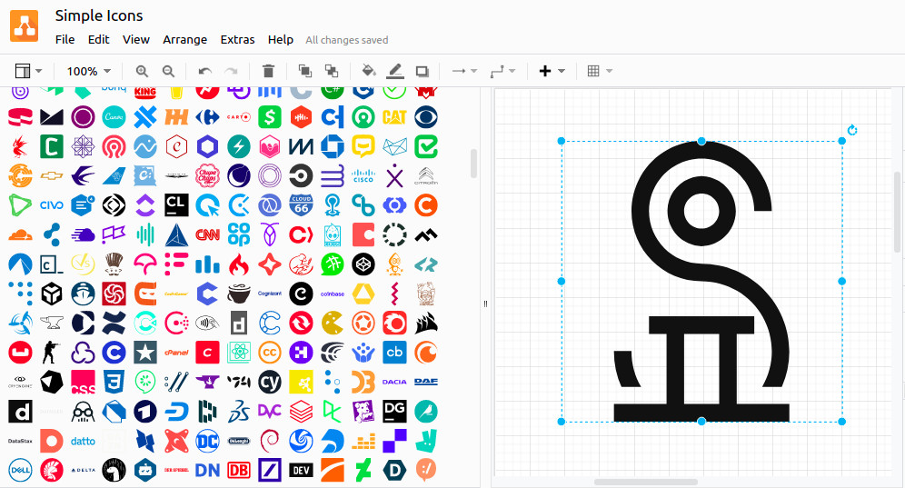

# [diagrams.net] library for [simple-icons]

Load all [simple-icons] brands directly to [drawio].

<p align="center">
  
</p>

## Usage

Inside a [drawio] project, go to `File` -> `Open library from` -> `URL` and
paste the next URL:

```
https://raw.githubusercontent.com/mondeja/simple-icons-drawio/master/simple-icons.xml
```

Note that could take a few seconds to load.

You can also start a new project in [diagrams.net] with the simple-icons
library loaded using [this link](https://app.diagrams.net/?splash=0&clibs=https%3A%2F%2Fraw.githubusercontent.com%2Fmondeja%2Fsimple-icons-drawio%2Fmaster%2Fsimple-icons.xml):

```
https://app.diagrams.net/?splash=0&clibs=https%3A%2F%2Fraw.githubusercontent.com%2Fmondeja%2Fsimple-icons-drawio%2Fmaster%2Fsimple-icons.xml
```

[diagrams.net]: https://www.diagrams.net/
[drawio]: https://github.com/jgraph/drawio
[simple-icons]: https://simpleicons.org/
